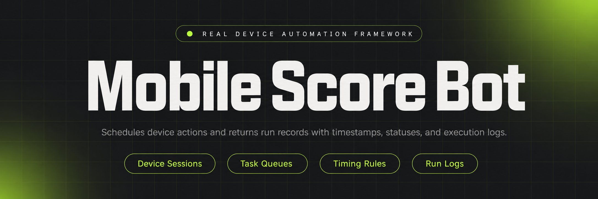
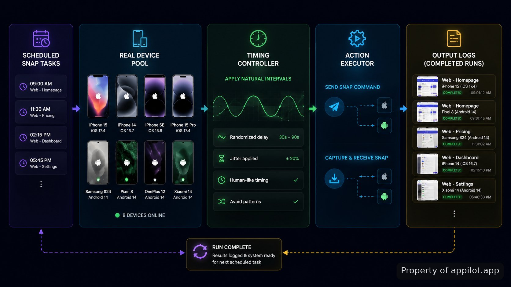

<p align="center">
  <a href="https://www.appilot.app" target="_blank" rel="nofollow">
    
  </a>
</p>

## snapchat bots for score

This repository demonstrates snapchat bots for score as a reference implementation for real-device automation patterns. The project focuses on how mobile devices can send and receive snaps through scheduled actions while keeping timing behavior closer to human usage patterns. The workflow uses physical Android or iOS hardware rather than virtual devices, with separate stages for device control, action scheduling, and run records.

> A reference architecture for controlled mobile interaction flows using connected devices.

The repository is structured as a proof of concept rather than a ready-made account growth system. It shows the components involved in a mobile automation pipeline: device sessions, action queues, timing rules, and output logs. The approach is useful for developers studying how automation jobs are divided across hardware, orchestration, and reporting layers.

<a href="https://www.appilot.app" target="_blank" rel="nofollow">
  
</a>

<p align="center">
  <a href="https://t.me/Bitbash333" target="_blank" rel="nofollow">
    
  </a>&nbsp;
  <a href="https://wa.me/923249868488?text=Hi%2C%20I%27m%20interested." target="_blank" rel="nofollow">
    
  </a>&nbsp;
  <a href="mailto:hello@appilot.app" target="_blank" rel="nofollow">
    
  </a>&nbsp;
  <a href="https://www.appilot.app" target="_blank" rel="nofollow">
    
  </a>
</p>



## Core Features

| Feature | Description |
| --- | --- |
| Physical Device Sessions | The project avoids emulator assumptions by organizing automation around connected Android and iOS hardware sessions. This removes the mismatch between simulated environments and real mobile behavior. |
| Scheduled Snap Actions | Repeated manual interactions are represented as queued actions with controlled execution times. The scheduler handles when a device should perform a configured send or receive step. |
| Natural Timing Patterns | Fixed repetitive intervals can make automated activity easier to identify. The timing layer applies variable delays and pacing rules based on the configured run pattern. |
| Device Action Control | Mobile actions are separated from scheduling logic, making it easier to trace whether a failed run came from the device layer or the task queue. |
| Run Logging | Missing visibility into automated sessions creates difficult debugging cycles. The logging layer records completed actions and execution states for later review. |

## Snapchat automation workflow

The workflow follows a simple sequence: a configured task enters the queue, a connected device receives the instruction, the automation layer performs the mobile action, and the result is written into run records. The architecture separates planning from execution so a developer can inspect each stage independently.

A typical run starts with a device identifier and a task schedule. For example, a device session may receive a batch containing several snap actions, each with its own delay window. The executor then processes those actions one by one and stores whether each step completed or failed. This separation helps diagnose common problems such as disconnected hardware, expired sessions, or incomplete actions.

The design follows common mobile testing concepts. Physical device automation platforms such as <a href="https://appium.io/docs/en/latest/" target="_blank" rel="nofollow">Appium documentation</a> describe how mobile actions can be controlled through automation interfaces, while <a href="https://developer.android.com/training/testing" target="_blank" rel="nofollow">Android developer testing documentation</a> covers the challenges of validating behavior on actual devices.

## Real device automation approach

The main implementation choice is using hardware instead of emulators. Real device automation is closer to the environment where mobile applications normally run, including operating system behavior, network conditions, and device-specific differences.

The stack is organized around device controllers, task workers, and storage for execution history. Android devices can be managed through <a href="https://developer.android.com/tools/adb" target="_blank" rel="nofollow">Android Debug Bridge documentation</a>, while iOS workflows commonly rely on Apple's mobile development tooling described in the <a href="https://developer.apple.com/documentation/xcode" target="_blank" rel="nofollow">Xcode documentation</a>.

This repository does not attempt to hide automation activity or bypass platform protections. Snapchat's rules restrict certain automated behavior, and developers should review the <a href="https://www.snap.com/terms" target="_blank" rel="nofollow">Snap Terms of Service</a> before applying automation patterns to accounts or production environments.

## Project structure

```text
mobile-score-automation-reference/
├── src/
│   ├── device_controller.py
│   ├── scheduler.py
│   ├── executor.py
│   └── logger.py
├── config/
│   ├── devices.yaml
│   └── timing.yaml
├── data/
│   └── runs.json
├── requirements.txt
└── README.md
```

The directory layout keeps device handling, scheduling rules, and execution records separate. This makes the repository easier to examine as a reference architecture because each responsibility has a clear location. Configuration files describe connected hardware and timing behavior, while source files contain the execution path.

<a href="https://tally.so/r/yP5oDx?platform=GitHub&amp;format=Product+repo&amp;brand=Appilot&amp;niche=appilot&amp;page=snapchat+bots+for+score+using+Android+Hardware&amp;date=2026-09-03" target="_blank" rel="nofollow">
  
</a>

## Technical stack and execution model

The implementation uses a mobile automation framework pattern: Python-based orchestration manages task flow, device communication handles hardware actions, and configuration files store repeatable run settings. A lightweight structure keeps the proof of concept focused on the mechanics of automation rather than a large application layer.

```bash
git clone repository-url
cd mobile-score-automation-reference
pip install -r requirements.txt
python src/scheduler.py
```

A normal execution cycle reads device settings, loads timing rules, creates queued actions, and starts the executor. The resulting records can show completed tasks, timestamps, and device states. Similar logging practices are recommended in mobile testing guidance from resources such as <a href="https://mas.owasp.org/MASTG/" target="_blank" rel="nofollow">OWASP Mobile Security Testing Guide</a>, where visibility into mobile behavior is a core testing concern.

## Mobile automation framework considerations

Automation on consumer platforms requires careful handling of sessions, permissions, connectivity, and policy restrictions. A device that loses network access or changes state can affect the entire sequence, so each layer should report its own status instead of producing a single unexplained failure.

The repository demonstrates the architecture only. It is intended for understanding how real-device automation pipelines are assembled, including the relationship between hardware access, scheduling, and execution reporting. It should not be treated as permission to automate activities that violate a platform's rules.

## Use Cases

- Developers studying mobile automation can inspect how scheduled device actions are divided into queue management, execution, and logging layers.
- QA engineers can adapt the architecture pattern for controlled mobile interaction tests where physical devices are required.
- Automation researchers can use the repository as a reference for comparing emulator-based flows with hardware-based execution models.
- Mobile operations teams can review the structure before designing internal device orchestration systems with similar components.

## How to Automate Snap Sending Using snapchat bots for score

- **STEP 1 — Download & Set Up the Project**
Download, set up, and install **snapchat bots for score** to get the project running from the repository files.
- **STEP 2 — Connect Devices**
Open the project configuration and register connected Android or iOS hardware through the device settings file.
- **STEP 3 — Configure Tasks**
Select timing rules, device identifiers, and snap action parameters inside the configuration files before execution.
- **STEP 4 — Run Automation**
Start the scheduler command and review generated run records showing completed actions and execution states.

## Limitations and policy notes

The repository demonstrates technical structure, not a guarantee that automated activity will be accepted by a third-party platform. Platform policies can change, and account restrictions may apply when automation is used outside approved scenarios.

The most important boundary is transparency: the code shows how device automation components communicate, how schedules are processed, and how outputs are recorded. It does not remove the need to evaluate platform rules, user consent, or operational requirements before deployment.

## Reference measurements and validation

Validation for this type of project focuses on execution accuracy rather than engagement results. Useful checks include whether device commands complete, whether scheduled delays are respected, and whether logs provide enough information to reproduce a failed run.

A sample validation cycle can review 10 queued actions, compare expected and recorded timestamps, and inspect failed device responses. These measurements help separate software errors from network interruptions or hardware availability issues.

The repository is most useful when treated as an engineering reference: it explains the moving parts behind mobile automation, the files involved, and the operational limits that matter before using a similar architecture.

## FAQ

### Does this automation approach comply with Snapchat rules?

The repository does not claim compliance with automated account activity rules. Snapchat restricts certain automation behavior, so any use should be reviewed against current platform terms and applicable requirements.

### Does the repository use emulators or real devices?

The reference architecture is based on physical Android and iOS hardware rather than emulator-only execution. The design focuses on device sessions, action control, and recorded outcomes from connected devices.

### What inputs and outputs are handled by the automation flow?

Inputs include device settings, timing rules, and configured snap actions. Outputs include execution records showing completed actions, timestamps, and device status information.

<table>
  <tr>
    <td align="center" width="33%">
      
      <p>This scraper helped me gather thousands of posts effortlessly. The setup was fast, and exports are super clean and well-structured.</p>
      <p><b>Nathan Pennington</b><br>Marketer<br>★★★★★</p>
    </td>
    <td align="center" width="33%">
      
      <p>What impressed me most was how accurate the extracted data is. Likes, comments, timestamps — everything aligns perfectly.</p>
      <p><b>Greg Jeffries</b><br>SEO Affiliate Expert<br>★★★★★</p>
    </td>
    <td align="center" width="33%">
      
      <p>It's by far the best tool I've used. Ideal for trend tracking, competitor monitoring, and influencer insights.</p>
      <p><b>Karan</b><br>Digital Strategist<br>★★★★★</p>
    </td>
  </tr>
</table>